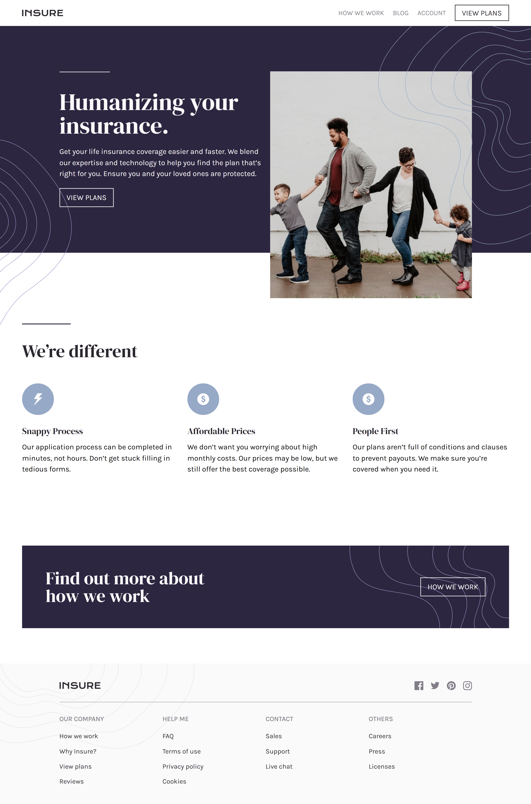
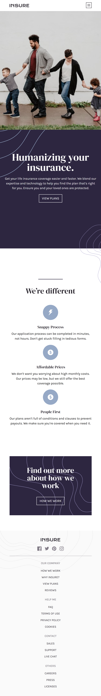

# Frontend Mentor - Insure landing page solution

This is a solution to the [Insure landing page challenge on Frontend Mentor](https://www.frontendmentor.io/challenges/insure-landing-page-uTU68JV8). Frontend Mentor challenges help you improve your coding skills by building realistic projects.

## Table of contents

- [Overview](#overview)

  - [The challenge](#the-challenge)
  - [Screenshot](#screenshot)
  - [Links](#links)

  - [Built with](#built-with)
  - [What I learned](#what-i-learned)

- [Author](#author)

### The challenge

Users should be able to:

- View the optimal layout for the site depending on their device's screen size
- See hover states for all interactive elements on the page

### Screenshot

### Links

- Solution URL: [Solution URL here]()
- Live Site URL: [Live site URL here]()

### Built with

- Semantic HTML5 markup
- CSS custom properties
- Flexbox
- CSS Grid
- Desktop-first workflow
- Sass

### What I learned

Undertaking this project allowed me to critically advance my proficiency in CSS Grid and SCSS. The journey, especially in perfecting the responsive aspects of the landing page, presented valuable challenges that I diligently worked through. I am now keen to leverage this refined understanding and actively pursue further learning opportunities.

## Author

- Website - [Nwaobi Emmanuel](https://github.com/EmmanuelNwaobi)
- Frontend Mentor - [@yourusername](https://www.frontendmentor.io/profile/EmmanuelNwaobi)
